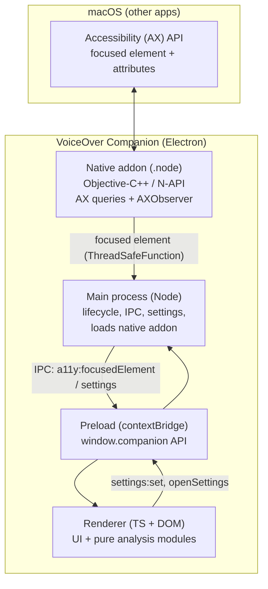

# VoiceOver Companion — Architecture & Demo

> A live accessibility co-pilot for testing web apps with VoiceOver on macOS.
>
> This doc doubles as a slide deck (slides are separated by `---`, compatible with
> Marp / reveal.js / Deckset) and an interview-style Q&A you can study before the demo.

---

## What it is, in one sentence

As you move keyboard focus around a web page, a small floating window shows **what
VoiceOver is likely to announce** for the focused element, **flags likely accessibility
problems**, and **suggests the VoiceOver commands to try next** — without you having to
learn VoiceOver first.

---

## The problem it solves

- Most developers **don't know how to drive VoiceOver**, so accessibility testing gets
  skipped or done badly.
- VoiceOver's output is **ephemeral and audio-only** — hard to inspect, screenshot, or
  reason about while coding.
- Browser dev-tools show the DOM/ARIA, but **not what the screen reader will actually
  say**, which is the thing that matters to a blind user.

**Goal:** make the screen-reader experience *visible* and *teachable* for sighted devs.

---

## Demo script (what I'll show)

1. **Launch** → first-run onboarding (3 steps: what it is → grant permission → how to use).
2. Open **Safari** next to the floating panel.
3. Tab through a form / links. The panel updates **live** with:
   - the **announcement** ("Email, edit text, blank"),
   - a **"Why this announcement?"** breakdown (which AX attribute produced each word),
   - **potential issues** (e.g. an image with no alt text → "error"),
   - **"Try next"** (contextual VoiceOver key commands).
4. Switch to **Chrome** → a banner appears: *"VoiceOver is designed for Safari…"*.
5. Open the **Settings** tab → toggle live tracking, pin, opacity; "Show welcome guide".

---

## High-level architecture



The interesting boundary is **left to right**: macOS AX → C++ → Node → sandboxed UI.

---

## The three Electron processes (+ one native addon)

| Layer | Tech | Responsibility |
|---|---|---|
| **Native addon** | Objective-C++ (`.mm`), N-API | Talk to the macOS Accessibility API; observe focus changes |
| **Main** | Node / TS (`src/main.ts`) | App lifecycle, window, load addon, IPC, settings store |
| **Preload** | TS (`src/preload.ts`) | Expose a tiny, safe API to the UI via `contextBridge` |
| **Renderer** | TS + DOM (`src/renderer.ts` + modules) | The visible panel + all the "what does this mean" logic |

No UI framework — it's plain TypeScript and DOM. Keeps the bundle tiny and the
behaviour easy to reason about.

---

## The hard part: reading *other apps'* UI

macOS exposes a system-wide **Accessibility (AX) API**. The same API VoiceOver itself
uses. Our native addon:

1. Asks for the **system-wide focused element**:
   `AXUIElementCreateSystemWide()` → `kAXFocusedUIElementAttribute`.
2. Reads its attributes: `AXRole`, `AXSubrole`, `AXRoleDescription`, `AXTitle`,
   `AXValue`, `AXDescription`, `AXHelp`, `AXEnabled`, `AXFocused`.
3. Also resolves the owning app (PID → `NSRunningApplication` → bundle id + name).

This requires the user to grant **Accessibility permission**
(System Settings → Privacy & Security → Accessibility). We check with
`AXIsProcessTrusted()` and prompt with `isTrustedAccessibilityClient(true)`.

---

## The Chromium gotcha (a good war story)

Chromium/WebKit apps (Chrome, Edge, Electron, even Safari) **don't expose their web AX
tree until asked**. If you just query the focused element, you get nothing.

Fix: before querying, we "unlock" the frontmost app by setting two private-ish
attributes on it:

```objc
AXUIElementSetAttributeValue(appRef, CFSTR("AXManualAccessibility"), kCFBooleanTrue);
AXUIElementSetAttributeValue(appRef, CFSTR("AXEnhancedUserInterface"), kCFBooleanTrue);
```

On a normal native app this is a harmless no-op. This is exactly what assistive tech
does under the hood — it's the difference between "no focused element" and a rich tree.

---

## Live tracking (no polling)

We don't poll on a timer. We use an **`AXObserver`**:

1. Get the frontmost app's PID (`NSWorkspace.frontmostApplication`).
2. Create an `AXObserver` for that PID and subscribe to
   `kAXFocusedUIElementChangedNotification` + `kAXFocusedWindowChangedNotification`.
3. Add its run-loop source to the **main run loop**.
4. When the user **switches apps**, an `NSWorkspace` notification fires and we
   **detach + re-attach** the observer to the new frontmost app.

So it's **event-driven** — near-zero CPU when nothing is happening.

---

## Crossing the native → JS boundary safely

AX notifications fire on the main run loop; we hand each focus snapshot to JavaScript
through a **`Napi::ThreadSafeFunction`** — a queued, thread-safe bridge into Node's
event loop:

```cpp
g_tsfn.NonBlockingCall(payload, [](Napi::Env env, Napi::Function cb, FocusedData* d) {
  cb.Call({ BuildObject(env, *d) });   // build the JS object on the JS side
  delete d;                            // then free the C++ payload
});
```

Memory is handled deliberately: every `CFType` we copy is `CFRelease`d, Obj-C work is in
`@autoreleasepool`, and the observer is fully torn down on stop.

---

## From raw attributes to something useful (pure TS)

Everything below is **plain, deterministic TypeScript** — no Electron, no native — which
makes it **unit-testable**:

| Module | Job |
|---|---|
| `announce.ts` | Compose the likely VoiceOver utterance: *name → state → role → value → hint* |
| `issues.ts` | Heuristic checks (missing alt text, unnamed control, raw-URL link, empty heading, generic container, disabled-but-focusable…) |
| `concepts.ts` | "Learn more" knowledge base (what / why / how-to-fix) keyed to each issue |
| `next-actions.ts` | Map role+state → the most relevant VoiceOver commands |
| `browser.ts` | Classify the frontmost app → warn when it isn't Safari |
| `voiceover-guide.ts` | Static cheat-sheet of common VoiceOver commands |
| `settings.ts` | Persisted settings (validate / clamp / atomic write) |

---

## Example: synthesizing the announcement

For a focused empty email field, VoiceOver says something like **"Email, edit text,
blank."** We rebuild that from attributes and **show our working**:

- `name (title)` → "Email"
- `role (VoiceOver)` → "edit text"  *(VoiceOver says "edit text", even though
  `AXRoleDescription` is "text field" — we override to match reality)*
- `state (empty field)` → "blank"

The **"Why this announcement?"** panel lists each piece and the attribute it came from.
This is the teaching moment.

---

## Settings & onboarding

- **Settings** (live tracking on/off, always-on-top, opacity) persist to a JSON file in
  the app's `userData` dir. Written atomically (temp file + rename), validated and
  **clamped** on read (opacity floored at 0.3 so you can't make the window invisible).
- Changes apply **live** (main process reacts and updates the window) and broadcast to
  the UI so everything stays in sync.
- **First-run onboarding** is a 3-step in-window flow gated on a `hasOnboarded` flag, and
  re-openable any time from Settings → "Show welcome guide".

---

## The window itself is a deliberate design choice

```
type: 'panel', alwaysOnTop: 'floating', focusable: false, showInactive()
```

The panel **never takes keyboard focus**. That's essential: if our own window grabbed
focus, *it* would become "the focused element" and we'd be inspecting ourselves. It
floats above the app under test like a HUD.

---

## Packaging, security & distribution

- **Build:** Electron Forge + Vite plugin; main/preload/renderer each built separately;
  app code packed into an **asar**.
- **Hardening (Electron Fuses):** `RunAsNode` off, cookie encryption on, asar integrity
  validation on, only-load-app-from-asar on, Node CLI inspect args off.
- **Native addon** isn't in `node_modules`, so it ships via Forge `extraResource` and is
  loaded from `process.resourcesPath` at runtime.
- **Signing/notarization** is **opt-in via env vars** — an unsigned DMG builds with zero
  credentials today; flip on signing once an Apple Developer ID cert exists.
- **Privacy:** **no network calls at all.** Everything stays on the machine.

---

## Testing

- **7 test files, 64 tests** (Vitest), covering the pure logic: announcement synthesis,
  issue rules, concept lookups, next-action mapping, browser classification, settings
  validation/clamping.
- The native addon and Electron wiring are verified **manually** (they need a real macOS
  AX environment, a running window, and OS permissions — not worth fragile mocks).

---

## Honest limitations (say these before they ask)

- The announcement is a **close approximation, not a capture** of VoiceOver's audio.
  Exact wording varies by macOS/VoiceOver version and language.
- It reads the **AX tree**, which is what AT *should* see — occasionally apps lie or lag
  (e.g. Chromium needs the "unlock" trick; a freshly-loaded page can be momentarily empty).
- **macOS-only** by design (built directly on Apple's AX + AppKit APIs).
- Heuristic issue checks are **hints to investigate**, not a conformance audit.

---

## Roadmap

- Signed + notarized distributable (needs Apple Developer Program).
- Stretch: **colour-contrast checks** (screen-recording permission → native region
  screenshot → WCAG contrast math) surfaced inline in the Inspector.

---

# Anticipated Q&A

Grouped by theme. Short answer first, then detail.

---

## Architecture & technology choices

**Q: Why Electron and not a native Swift/AppKit app?**
Speed of iteration and the fact that ~90% of the app is "turn data into explanatory UI" —
HTML/CSS/TS is ideal for that, and it keeps the door open to reuse the analysis logic
elsewhere. The genuinely OS-specific 10% (the AX calls) is isolated in a small native
addon. A pure-Swift app would be leaner but slower to build and harder to test the logic
in isolation.

**Q: Then why do you need native code at all?**
The macOS Accessibility API (`AXUIElement`, `AXObserver`) is a C API with no JavaScript
binding. To read other apps' focused elements and subscribe to focus changes, you must
call it from C/C++/Obj-C. So there's a thin Objective-C++ addon exposed to Node via N-API.

**Q: Why Objective-C++ specifically?**
The AX API is C, but resolving the owning app (bundle id, name) and the app-switch
notifications use AppKit (`NSWorkspace`, `NSRunningApplication`) which is Objective-C.
Objective-C++ (`.mm`) lets me mix the C AX calls, the Obj-C AppKit calls, and the C++
N-API in one file.

**Q: No React/Vue? Why plain DOM?**
The UI is small and mostly imperative (swap views, render a few lists). A framework would
add bundle size and indirection for little gain. Plain TS + DOM keeps it fast and
debuggable. The "smart" code lives in framework-free modules anyway.

---

## How it actually works

**Q: How do you read another application's UI?**
Through the system-wide Accessibility API: `AXUIElementCreateSystemWide()` then read
`kAXFocusedUIElementAttribute`, then copy that element's attributes. macOS gates this
behind the **Accessibility permission**.

**Q: How is the live update implemented — are you polling?**
No. An `AXObserver` subscribes to focus-change notifications for the frontmost app and
adds its source to the main run loop, so we only do work when focus actually changes.
When the user switches apps, an `NSWorkspace` activation notification tells us to
re-attach the observer to the new app.

**Q: How does data get from the native thread to JavaScript?**
Via a `Napi::ThreadSafeFunction`. Each focus snapshot is packaged as a plain C++ struct
and queued onto Node's event loop, where it's converted to a JS object and emitted. This
avoids touching V8 from the wrong context.

**Q: What's the `AXManualAccessibility` / `AXEnhancedUserInterface` thing?**
Chromium- and WebKit-based apps don't expose their web accessibility tree until an
assistive client asks for it. Setting those attributes on the app element "unlocks" the
tree. It's a no-op on normal native apps. Without it, Chrome/Safari report *no* focused
web element.

**Q: Does the app require VoiceOver to be running?**
No. It reads the same AX tree VoiceOver would, and **predicts** what VoiceOver would say.
You can use it with VoiceOver off — which is the whole point for devs who can't drive it.

**Q: Is the announcement the *real* VoiceOver output?**
No — it's **synthesized** from the AX attributes to match VoiceOver's phrasing closely
(name → state → role → value → hint), including overrides where VoiceOver's word differs
from `AXRoleDescription` (e.g. "edit text"). It's a faithful approximation, not an audio
capture. I'm upfront about this in the UI.

**Q: Why recommend Safari?**
VoiceOver is developed and tuned against Safari/WebKit; other browsers' AX mappings drift.
So results are most accurate in Safari. We detect the frontmost browser by bundle id and
show a non-blocking banner for non-Safari browsers.

---

## Security & privacy

**Q: This can read any app's UI — isn't that dangerous?**
It can only do so **after the user explicitly grants Accessibility permission**, which is
the standard macOS gate for assistive tech. It reads only the *focused* element's
accessibility attributes, and **sends nothing anywhere** — there are no network calls.

**Q: What's your Electron security posture?**
Defaults plus hardening: context isolation on, Node integration off and renderer
sandboxed (Electron defaults), a minimal `contextBridge` surface in the preload (no raw
`ipcRenderer` exposed), and Electron **Fuses** disabling `RunAsNode`, Node CLI inspect,
and `NODE_OPTIONS`, plus asar integrity + only-load-from-asar.

**Q: Where do settings get stored, and is anything sensitive in there?**
A small JSON file in the app's `userData` directory — just UI prefs (tracking, pin,
opacity, onboarding flag). Nothing sensitive. Writes are atomic (temp + rename) and every
field is validated/clamped on read, so a corrupted or tampered file can't crash or
mis-configure the app.

**Q: Why a hand-rolled settings store instead of `electron-store`?**
The corporate npm registry blocked that package, and the need was tiny (load/merge/save a
flat object). A ~100-line dependency-free store with validation, clamping, atomic writes,
and a change subscription was simpler than fighting the registry and added zero
supply-chain risk.

---

## Quality, testing, performance

**Q: What's tested and what isn't?**
All the pure logic (announcement synthesis, issue rules, concepts, next actions, browser
classification, settings validation) — 64 unit tests across 7 files. The native addon and
Electron glue are verified manually, because faithfully mocking the macOS AX environment
would test the mock, not the code.

**Q: Performance / battery impact?**
Event-driven, so idle cost is negligible — no timer, no polling. Work happens only on a
focus change or app switch, and each event reads ~9 attributes from one element.

**Q: Memory safety in the native code?**
Every Core Foundation value we copy is `CFRelease`d, Obj-C allocations are wrapped in
`@autoreleasepool`, and `stopFocusTracking` removes the run-loop source, the workspace
observer, and releases the observer + thread-safe function. The thread-safe payloads are
freed on the JS side after use.

**Q: npm audit shows lots of highs — are you shipping vulnerabilities?**
No. All 31 findings are **build/dev dependencies** (Electron Forge's `tar`/`tmp` chain,
Vite's `esbuild`) — none are in the app's runtime dependencies, so none ship to users.
We're on the latest Forge 7.x; the only "fixes" are breaking downgrades, so the decision
was to accept them as dev-only and revisit at the Forge 8 line.

---

## Product & scope

**Q: Why did you remove the manual "capture" shortcut?**
It was an on-demand snapshot from the era before live tracking. Once the `AXObserver`
pipeline existed, it was redundant; live tracking covers the same need automatically, so
removing it simplified the model.

**Q: Could this be cross-platform?**
Not as-is — it's built directly on Apple's AX + AppKit APIs. Windows (UI Automation) and
Linux (AT-SPI) have analogous APIs, so the *architecture* (native shim → Node → UI) would
transfer, but each platform needs its own native layer and phrasing model.

**Q: Who is it for?**
Front-end developers and QA who need to check screen-reader behaviour but don't know
VoiceOver — and as a teaching aid for accessibility generally.

**Q: How is it distributed today?**
An unsigned macOS DMG (builds with no credentials). Signing + notarization are wired and
gated behind env vars, ready to switch on once an Apple Developer ID certificate is
available so it installs cleanly on other Macs.

---

If they go deep, the one-line mental model: **macOS Accessibility API → tiny Obj-C++/N-API
addon → Electron main → sandboxed UI, with all the "what does this mean" logic in pure,
unit-tested TypeScript.**
